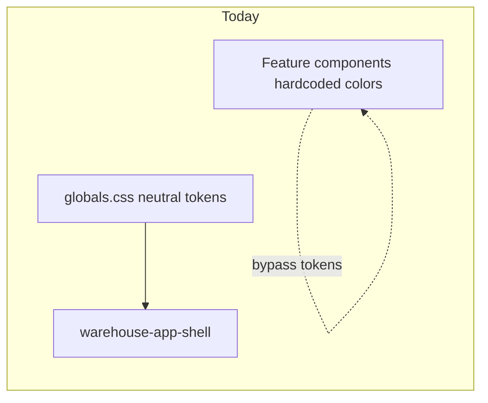
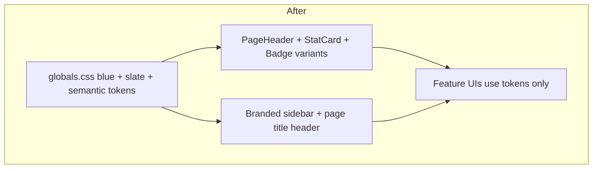

# Professional UI Refresh (Industrial Blue + Slate)

## Current state

The app is **Next.js 16 + shadcn/ui + Tailwind v4** with all theme tokens in [`app/globals.css`](app/globals.css). Today it uses **achromatic neutral** colors (black/gray primary), a minimal sidebar shell in [`components/warehouse-app-shell.tsx`](components/warehouse-app-shell.tsx), and **ad-hoc** `text-green-600`, `bg-blue-50`, etc. across treasury, debts, sales, returns, and reports.



## Target design direction

| Role | Direction |
|------|-----------|
| Primary | Deep industrial blue (~`oklch(0.45 0.12 250)`) for buttons, active nav, links |
| Neutrals | Cool slate backgrounds and borders (not pure gray) |
| Sidebar | Slightly tinted slate panel; active item uses `sidebar-primary` blue |
| Success / income | Teal-green semantic token (not raw `green-600`) |
| Warning / pending | Amber semantic token |
| Danger / expense / debt | Existing `destructive` + semantic danger backgrounds |
| Info | Blue-tinted semantic token for neutral highlights |

Light mode only—no theme toggle; `.dark` block can stay for future use but will not be exposed in UI.

---

## Phase 1: Design system foundation

### 1.1 Update [`app/globals.css`](app/globals.css)

- Replace `:root` OKLCH values for `primary`, `secondary`, `muted`, `accent`, `border`, `ring`, and all `sidebar-*` tokens with the industrial blue + slate palette.
- Add **semantic CSS variables** and map them in `@theme inline`:

```css
/* example additions */
--success: oklch(...);
--success-foreground: oklch(...);
--warning: oklch(...);
--info: oklch(...);
```

Then expose as `--color-success`, `--color-warning`, `--color-info` so Tailwind classes like `text-success`, `bg-success/10` work app-wide.

- Align `--chart-1`…`--chart-5` with the brand palette for any future charts.
- Slightly increase visual polish: `--radius: 0.75rem` for softer cards.

### 1.2 Extend [`components/ui/badge.tsx`](components/ui/badge.tsx)

Add CVA variants: `success`, `warning`, `info`, `destructive` (outline + soft fill using semantic tokens). This replaces repeated `bg-green-100 text-green-800` strings.

### 1.3 New shared UI primitives (small, high reuse)

| Component | File | Purpose |
|-----------|------|---------|
| `PageHeader` | `components/ui/page-header.tsx` | Title, optional description, optional actions slot—used on every protected page |
| `StatCard` | `components/ui/stat-card.tsx` | KPI card: icon, label, value, subtitle, optional `tone` (`default` \| `success` \| `danger` \| `warning` \| `info`) with left accent border + tinted icon background |
| `statusStyles` helper | `lib/status-styles.ts` | `getStatusBadgeVariant(status)` and `getTransactionTone(type)` maps for sales/debts/returns/treasury |

---

## Phase 2: App shell and global polish

### 2.1 Enhance [`components/warehouse-app-shell.tsx`](components/warehouse-app-shell.tsx)

- **Sidebar header**: Small warehouse icon (Lucide `Warehouse` or `Package`) in a rounded `bg-sidebar-primary` badge; “Makhazeny” in semibold + “Warehouse Management” subtitle.
- **Active nav**: Rely on shadcn `isActive` (already wired)—will pick up new `sidebar-primary` automatically.
- **Main header**: Show current page title derived from `MENU_ITEMS` + pathname (breadcrumb-style), subtle `bg-background/95 backdrop-blur` border.
- **Content area**: Subtle gradient or pattern optional—keep `bg-muted/40` but tune to slate tint via updated `--muted`.

### 2.2 Fix [`app/layout.tsx`](app/layout.tsx)

- Wire Geist fonts properly: `className={cn(geist.variable, geistMono.variable, "font-sans antialiased")}` on `<body>`.
- Update metadata from “v0 App” to **Makhazeny Warehouse**.

### 2.3 Optional page wrapper

Apply consistent top spacing via `PageHeader` on all 8 protected routes under [`app/(protected)/`](app/(protected)/)—e.g. Products page currently only has a bare `<h1>`:

```37:39:app/(protected)/products/page.tsx
      <motion.div className="flex items-center justify-between">
        <h1 className="text-3xl font-bold tracking-tight">Products Management</h1>
      </motion.div>
```

Replace with `<PageHeader title="..." description="..." />` for a uniform, professional page chrome.

---

## Phase 3: Refactor feature UIs to tokens

Replace hardcoded Tailwind color utilities with semantic tokens + new components.

| File | Changes |
|------|---------|
| [`components/treasury/treasury-dashboard.tsx`](components/treasury/treasury-dashboard.tsx) | 5 plain `Card`s → `StatCard` with tones; loading skeletons match |
| [`components/treasury/treasury-transactions.tsx`](components/treasury/treasury-transactions.tsx) | Badge/status via `statusStyles` + badge variants |
| [`components/treasury/treasury-list.tsx`](components/treasury/treasury-list.tsx) | Income/expense columns use `text-success` / `text-destructive` |
| [`components/debts/debts-list.tsx`](components/debts/debts-list.tsx) | Overdue row: `bg-destructive/5`; amounts use semantic colors |
| [`components/debts/debt-payment-form.tsx`](components/debts/debt-payment-form.tsx) | Paid/remaining use `text-success` / `text-destructive` |
| [`components/sales/sales-list.tsx`](components/sales/sales-list.tsx) | Status badges via helper |
| [`components/returns/returns-list.tsx`](components/returns/returns-list.tsx) | Icons + badges via tokens |
| [`app/(protected)/reports/page.tsx`](app/(protected)/reports/page.tsx) | Largest win: replace ~20 `bg-*-50` boxes with `StatCard` grid inside existing `Card` sections |

List/table pages (products, customers, suppliers) get lighter touch: `Card` with `shadow-sm`, table header `bg-muted/50`, search input with consistent width—no logic changes.

---

## Phase 4: Micro-interactions and consistency (light touch)

- **Tabs**: Ensure active tab uses `data-[state=active]:bg-background data-[state=active]:text-primary` where pages use tabs (already mostly shadcn-default).
- **Tables**: Shared `TableHead` row styling via one repeated class in list components (`text-muted-foreground font-medium`).
- **Buttons**: Primary actions stay `default`; destructive actions keep `destructive` variant.
- **Sonner**: Already `richColors`—works with new destructive/success hues.

No new dependencies required.

---

## Files touched (summary)

**Core (4):** `app/globals.css`, `app/layout.tsx`, `components/warehouse-app-shell.tsx`, `components/ui/badge.tsx`

**New (3):** `components/ui/page-header.tsx`, `components/ui/stat-card.tsx`, `lib/status-styles.ts`

**Feature refactors (8):** treasury (3), debts (2), sales-list, returns-list, reports page

**Page headers (8):** all `app/(protected)/*/page.tsx`

**Out of scope:** RTL/Arabic layout, dark mode toggle, auth screens, Prisma/API logic, duplicate [`styles/globals.css`](styles/globals.css) (can delete or sync in a follow-up to avoid drift).

---

## Visual outcome (before → after)



You will see: branded blue sidebar accent, cohesive KPI cards on Treasury/Reports, consistent status badges everywhere, and professional page titles—without changing any business logic or API behavior.

## Verification

1. Run `npm run dev` and spot-check: Treasury dashboard, Reports generated stats, Debts overdue row, Sales status badges, sidebar active state.
2. Run `npm run build` to ensure no Tailwind class typos on new semantic tokens.
3. Quick responsive check: sidebar collapsed (icon mode) still shows brand icon.
