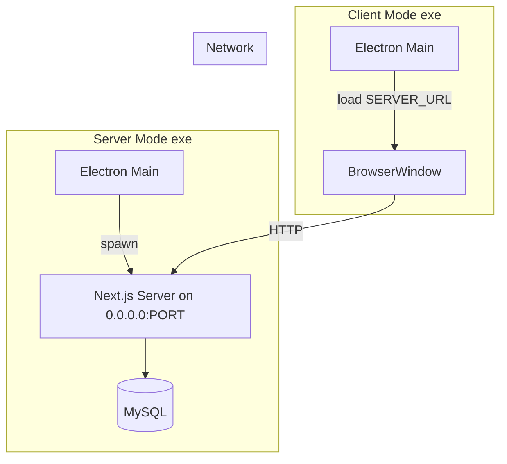

# Client-Server Architecture and Server Verification Plan

## Current State

- **Electron main** ([electron/main.js](electron/main.js)): Single mode only; starts embedded Next.js server bound to 127.0.0.1; uses raw TCP socket for readiness (any app on port could pass).
- **No health API** exists; no `/api/health` route.
- **All frontend API calls** use relative URLs (`fetch("/api/...")`) in [app/page.tsx](app/page.tsx), [components/payroll-table.tsx](components/payroll-table.tsx), [components/time-sheet-dashboard.tsx](components/time-sheet-dashboard.tsx), [components/days-off-dashboard.tsx](components/days-off-dashboard.tsx), [components/payroll-dashboard.tsx](components/payroll-dashboard.tsx), and attendance/checkin/checkout/admin/scanner pages.
- **No `lib/api-client.ts**`; no `APP_MODE`, `SERVER_URL`, or client mode.

## Target Architecture




---

## Part 1: Health API and Verification (Verify Server Plan)

### 1.1 Add health API route

- **New file:** [app/api/health/route.ts](app/api/health/route.ts)
- **Behavior:** `GET` returns `NextResponse.json({ ok: true }, { status: 200 })`. No database or heavy logic. Pattern follows existing routes (import `NextResponse`, export `async function GET()`).

### 1.2 Electron: verify server via health endpoint (server mode)

**File:** [electron/main.js](electron/main.js)

- **Replace `waitForServer(port, timeoutMs)`:** Use HTTP GET to `http://127.0.0.1:${port}/api/health` instead of raw TCP connect. Resolve `true` only when status is 200; otherwise retry until timeout then resolve `false`. Use Node `http`/`https` based on protocol.
- **After server is ready (packaged server mode only):**
  - Get local IP via `require('os').networkInterfaces()`: first non-internal IPv4 (skip `internal: true`).
  - Show `dialog.showMessageBox` with `type: 'info'`:  
  `"Server is running. This machine: http://127.0.0.1:<port>. Other machines: http://<localIP>:<port>"`  
  - If no local IP found, show only `http://127.0.0.1:<port>` and `http://0.0.0.0:<port>`.

---

## Part 2: Client-Server Architecture

### 2.1 Configuration and env

**File:** [.env.example](.env.example)

Add and document:

```env
# Application mode: 'server' (runs with DB) or 'client' (connects to remote)
APP_MODE=server

# Server mode
SERVER_HOST=0.0.0.0
SERVER_PORT=4000

# Client mode – remote server URL
SERVER_URL=http://192.168.1.100:4000
```

Keep existing MySQL vars. Update `loadEnvFromExeDir()` usage to read these.

### 2.2 Electron main: dual-mode flow

**File:** [electron/main.js](electron/main.js)

- **On startup:** Load env, read `APP_MODE` (default `server`).
- **Server mode:**
  - Find port (respect `SERVER_PORT` or fallback to 3000/3001/…).
  - Set `HOSTNAME` from `SERVER_HOST` (default `0.0.0.0`) so Next.js binds to network.
  - Spawn standalone server with `HOSTNAME` and `PORT`.
  - Use health-based `waitForServer` (see 1.2).
  - Show "Server is running" dialog with URLs.
  - `createWindow(`[http://127.0.0.1:${port}`)](http://127.0.0.1:${port}`)``) (local access; server is on 0.0.0.0 for others).
- **Client mode:**
  - Implement `checkServerReachable(url)`:
    - Normalize URL (base only, no path).
    - GET `baseUrl + '/api/health'`.
    - Use `https` module when protocol is `https:`.
    - Resolve `true` only when status 200; otherwise `false`.
  - If `checkServerReachable(SERVER_URL)` is false: show error dialog, do **not** call `createWindow`. Quit or let user retry.
  - If true: `createWindow(SERVER_URL)`.
  - Do **not** start the embedded Next.js server.

### 2.3 API client and frontend (client-mode flexibility)

**New file:** [lib/api-client.ts](lib/api-client.ts)

- Export `getApiBase(): string` returning `process.env.NEXT_PUBLIC_API_BASE_URL || ''`.
- When loading from `SERVER_URL`, the page is same-origin, so empty base is fine. This keeps future flexibility (e.g. different API origin).

**File:** [next.config.mjs](next.config.mjs)

- Add `env: { NEXT_PUBLIC_API_BASE_URL: process.env.NEXT_PUBLIC_API_BASE_URL || '' }` so the client can read it.

**Frontend:** Update API calls to use base URL. Replace patterns like:

```ts
fetch("/api/users")
```

with:

```ts
const apiBase = process.env.NEXT_PUBLIC_API_BASE_URL || ''
fetch(`${apiBase}/api/users`)
```

**Files to update (all fetch calls to `/api/...`):**

- [app/page.tsx](app/page.tsx) – payroll, payroll-data, users
- [components/payroll-table.tsx](components/payroll-table.tsx)
- [components/payroll-dashboard.tsx](components/payroll-dashboard.tsx)
- [components/time-sheet-dashboard.tsx](components/time-sheet-dashboard.tsx)
- [components/days-off-dashboard.tsx](components/days-off-dashboard.tsx)
- [app/attendance/page.tsx](app/attendance/page.tsx)
- [app/checkin/page.tsx](app/checkin/page.tsx)
- [app/checkout/page.tsx](app/checkout/page.tsx)
- [app/attendance-log/page.tsx](app/attendance-log/page.tsx)
- [app/scanner-monitor/page.tsx](app/scanner-monitor/page.tsx)
- [app/test-scanner-log/page.tsx](app/test-scanner-log/page.tsx)
- [app/admin/users-qr/page.tsx](app/admin/users-qr/page.tsx)
- [app/admin/qr-generator/page.tsx](app/admin/qr-generator/page.tsx)

For convenience, consider a small helper in `lib/api-client.ts`:

```ts
export function apiUrl(path: string): string {
  const base = process.env.NEXT_PUBLIC_API_BASE_URL || ''
  return `${base}${path.startsWith('/') ? path : '/' + path}`
}
```

Then `fetch(apiUrl('/api/users'))`.

### 2.4 CORS (if needed)

Client mode loads from `SERVER_URL` (same origin as API), so CORS is not required for that case. If you later serve the UI from a different origin, add CORS headers to API routes. No change needed for the described setup.

---

## Part 3: Optional In-App Connection Status

**File:** [app/layout.tsx](app/layout.tsx) or a shared header

- Add a small component that fetches `/api/health` (using `apiUrl('/api/health')`) on load and optionally on interval or "Verify" button.
- Show "Connected" (green) when 200, "Disconnected" when it fails.

---

## Summary of Changes


| Item                                               | Change                                                                                                                                          |
| -------------------------------------------------- | ----------------------------------------------------------------------------------------------------------------------------------------------- |
| [app/api/health/route.ts](app/api/health/route.ts) | New: GET returns `{ ok: true }` status 200                                                                                                      |
| [lib/api-client.ts](lib/api-client.ts)             | New: `getApiBase()`, `apiUrl(path)`                                                                                                             |
| [electron/main.js](electron/main.js)               | Mode detection; health-based waitForServer; SERVER_HOST/SERVER_PORT; checkServerReachable; "Server is running" dialog; client mode strict check |
| [next.config.mjs](next.config.mjs)                 | Expose `NEXT_PUBLIC_API_BASE_URL` in `env`                                                                                                      |
| [.env.example](.env.example)                       | Document APP_MODE, SERVER_HOST, SERVER_PORT, SERVER_URL                                                                                         |
| 12+ frontend files                                 | Replace `fetch("/api/...")` with `fetch(apiUrl("/api/..."))`                                                                                    |
| [app/layout.tsx](app/layout.tsx) (optional)        | Connection status component                                                                                                                     |


---

## Testing Checklist

- Server mode: exe starts, binds to 0.0.0.0, health check passes, dialog shows correct URLs, app works locally and from other machines.
- Client mode with server up: health check passes, window opens to remote URL.
- Client mode with server down: error dialog, no window.
- Health API: `curl http://localhost:4000/api/health` returns 200 and `{ "ok": true }`.

