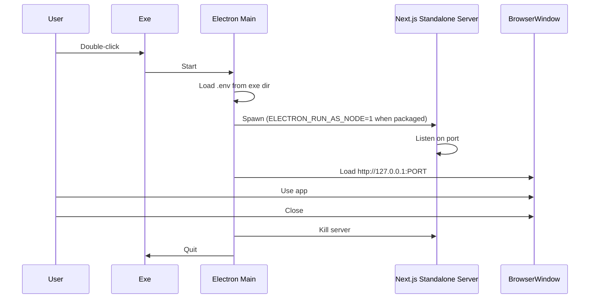

# Electron Desktop Exe: Full Implementation + Server Fix

## Current State

- **Next.js 16** app on port 4000, using MySQL ([lib/db.ts](lib/db.ts)) with env vars: `MYSQL_HOST`, `MYSQL_USER`, `MYSQL_PASSWORD`, `MYSQL_DATABASE`, `MYSQL_PORT` (or `DB_*` alternatives).
- No Electron or standalone build is configured.
- API routes under `app/api/` use relative URLs, so they will work when loading from the same origin in Electron.
- `server.ts` (HR Management/Express) is not needed for the in-app UI per Plan 1.

---

## Architecture




---

## Implementation Steps

### 1. Enable Next.js standalone output

- In [next.config.mjs](next.config.mjs), add `output: 'standalone'`.
- After `next build`, copy `.next/static` to `.next/standalone/.next/static` and `public` to `.next/standalone/public` (via build script).

### 2. Add Electron dependencies and scripts

- **DevDependencies:** `electron`, `electron-builder`.
- **package.json changes:**
  - `"main": "electron/main.js"`
  - Scripts: `electron:dev`, `electron:build`, and a build script that runs `next build`, copies static/public into standalone, then runs electron-builder.
  - `"build"` config for electron-builder (appId, win targets, files, extraResources).

### 3. Create Electron main process

- **New file:** [electron/main.js](electron/main.js)

**Responsibilities:**

- **Single instance:** `app.requestSingleInstanceLock()` so a second launch focuses the existing window.
- **Env loading:** `loadEnvFromExeDir()` to read `.env` from the exe directory (`path.dirname(process.execPath)` when packaged) and merge into child process env.
- **Development:** Start `next dev` (or use existing instance) and load `http://127.0.0.1:4000` in a `BrowserWindow`.
- **Production (packaged):**
  - Locate standalone folder (e.g. `path.join(process.resourcesPath, 'standalone')`).
  - Build env: `{ ...process.env, ...envFromFile, NODE_ENV: 'production', PORT }`.
  - **Fix from Plan 2:** When `app.isPackaged`, set `env.ELECTRON_RUN_AS_NODE = '1'` so the server runs as Node instead of Electron.
  - Spawn with `process.execPath` and `[serverPath]` (correct for both dev and packaged).
  - **Error reporting:** Buffer `child.stderr`; on timeout or early exit, include last N lines in `dialog.showErrorBox` so users see real errors (e.g. missing module, DB issues).
- **Port fallback:** Try 3000, then 3001, etc., to avoid conflicts.
- On window close/app quit: kill child process.

### 4. Environment variables for packaged app

- The app needs MySQL vars: `MYSQL_HOST`, `MYSQL_USER`, `MYSQL_PASSWORD`, `MYSQL_DATABASE`, `MYSQL_PORT` (or `DB_*`).
- Optional: `NEXT_PUBLIC_OT_MULTIPLIER` (default 1.5).
- Load from `.env` beside the exe; optionally ship `.env.example` documenting these vars.

### 5. electron-builder configuration

- **appId:** e.g. `com.advancedpayroll.app`
- **win:** `nsis` (installer + Desktop shortcut) and/or `portable` (single exe).
- **files/extraResources:** Include standalone output (server.js, .next/static, public) so main process can run `node server.js` from there.
- **Output:** `dist/` (e.g. `dist/Advanced Payroll.exe`).

### 6. Build and copy sequence

1. `next build`
2. Copy `.next/static` to `.next/standalone/.next/static`
3. Copy `public` to `.next/standalone/public` (if `public` exists)
4. Run electron-builder with the standalone tree included in resources

---

## Files to Add or Change


| Action   | File                                                    | Change                                                                                                              |
| -------- | ------------------------------------------------------- | ------------------------------------------------------------------------------------------------------------------- |
| Edit     | [next.config.mjs](next.config.mjs)                      | Add `output: 'standalone'`                                                                                          |
| Add      | `electron/main.js`                                      | Main process with env loading, ELECTRON_RUN_AS_NODE when packaged, stderr buffering, single instance, port fallback |
| Edit     | [package.json](package.json)                            | Add scripts, `main`, devDependencies, build config                                                                  |
| Add      | `scripts/electron-build.js` (or inline in package.json) | Post-build copy of static/public + electron-builder invocation                                                      |
| Optional | `.env.example`                                          | Document MYSQL_*, DB_*, NEXT_PUBLIC_OT_MULTIPLIER                                                                   |


---

## Summary of Plan 2 Integration

When implementing [electron/main.js](electron/main.js), include these from the start:

1. **ELECTRON_RUN_AS_NODE:** After building `env`, add:
  ```js
   if (app.isPackaged) env.ELECTRON_RUN_AS_NODE = '1';
  ```
2. **Stderr capture:** Buffer `child.stderr` and, on timeout or `child.on('exit', code => ...)` with non-zero code, append last N lines to the error dialog message.

---

## Result

- **Dev:** `npm run electron:dev` runs the app in Electron with the Next dev server.
- **Build:** `npm run electron:build` produces a Windows exe in `dist/`.
- **Run:** Double-click exe; Electron starts the Next standalone server as Node, opens the window; closing the window stops the server and exits. `.env` beside the exe is used for MySQL config.

