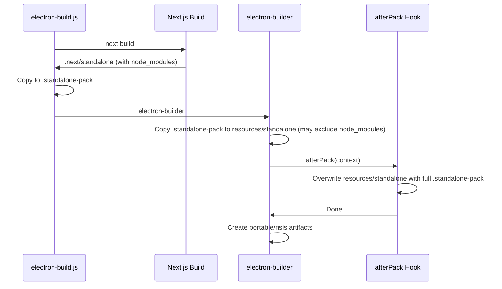

# Fix "Cannot find module 'next'" in Packaged Electron App

## Problem

The installed app at `C:\Users\CYBER-TECH\AppData\Local\Programs\advanced-payroll\` fails to start with:

```
Error: Cannot find module 'next'
requireStack: [...\resources\standalone\server.js]
```

The current fix (copying standalone to `.standalone-pack` and using it in `extraResources`) is in place, but electron-builder may still exclude `node_modules` when copying from that folder due to internal file filters.

## Root Cause

- [scripts/electron-build.js](scripts/electron-build.js) correctly copies the full `.next/standalone` (including `node_modules`) to `.standalone-pack` using `fs.cpSync`.
- [package.json](package.json) correctly points `extraResources` at `.standalone-pack`.
- electron-builder applies default filters that exclude `node_modules` directories, so the packaged `resources/standalone` ends up without `node_modules/next`.

## Solution: Use afterPack Hook to Overwrite Standalone

Add an **afterPack** hook that runs after electron-builder packs the app but before creating the installer. The hook will manually overwrite `resources/standalone` with the full contents of `.standalone-pack` (including `node_modules`), bypassing electron-builder's copy logic entirely.




## Implementation

### 1. Create afterPack hook script

**New file: [scripts/electron-after-pack.js**](scripts/electron-after-pack.js)

```js
const fs = require('fs');
const path = require('path');

exports.default = async function(context) {
  const projectRoot = context.packager.projectDir;
  const standalonePackDir = path.join(projectRoot, '.standalone-pack');
  const resourcesDir = context.packager.getResourcesDir(context.appOutDir);
  const standaloneDest = path.join(resourcesDir, 'standalone');

  if (!fs.existsSync(standalonePackDir)) {
    throw new Error('.standalone-pack not found. Ensure electron-build.js ran successfully.');
  }

  if (fs.existsSync(standaloneDest)) {
    fs.rmSync(standaloneDest, { recursive: true });
  }
  fs.mkdirSync(standaloneDest, { recursive: true });

  if (fs.cpSync) {
    fs.cpSync(standalonePackDir, standaloneDest, { recursive: true, verbatimSymlinks: false });
  } else {
    // Fallback for older Node
    require('./electron-copy-recursive')(standalonePackDir, standaloneDest);
  }
  console.log('afterPack: Copied full standalone (including node_modules) to resources/standalone');
};
```

### 2. Wire hook into package.json

In [package.json](package.json), add `afterPack` to the build config:

```json
"build": {
  "afterPack": "./scripts/electron-after-pack.js",
  ...
}
```

### 3. Rebuild and reinstall

After changes, the user must:

1. Close any running advanced-payroll instances.
2. Remove any stale lock: `Remove-Item .next\lock -Force -ErrorAction SilentlyContinue`
3. Run: `npm run electron:build`
4. Install the new build (portable exe or NSIS installer from `dist/`).
5. Run the newly installed app (old installs in `AppData\Local\Programs` are from previous builds).

## Files to Change


| File                                                             | Change                                                                                        |
| ---------------------------------------------------------------- | --------------------------------------------------------------------------------------------- |
| [scripts/electron-after-pack.js](scripts/electron-after-pack.js) | New file – afterPack hook that overwrites `resources/standalone` with full `.standalone-pack` |
| [package.json](package.json)                                     | Add `"afterPack": "./scripts/electron-after-pack.js"` to `build` config                       |


## Fallback for Node without fs.cpSync

If Node < 16.7 is used, `fs.cpSync` is unavailable. Options: (a) extract the existing `copyRecursive` from [scripts/electron-build.js](scripts/electron-build.js) into a shared module and require it from the hook, or (b) inline a small recursive copy in the hook. Node 22+ is used in this project, so `fs.cpSync` is safe to use.